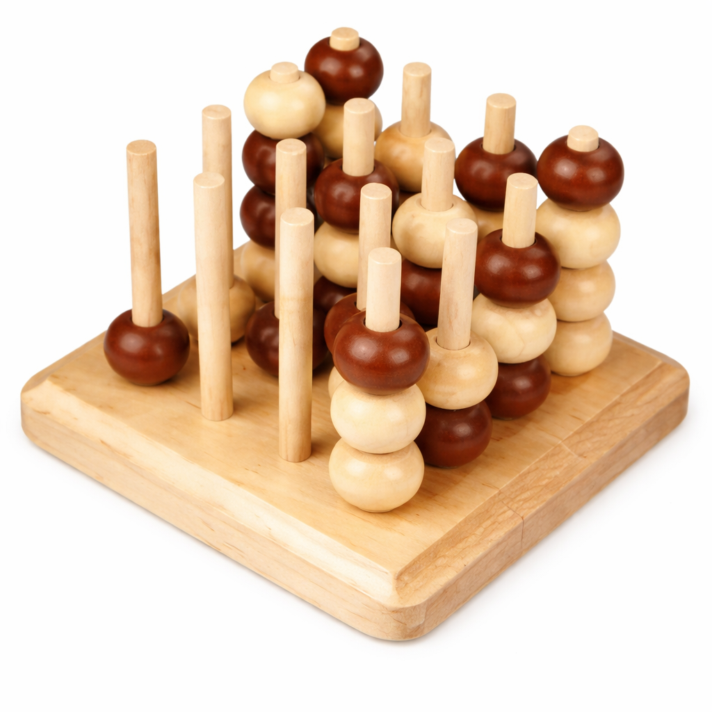

# Score Four Zero

AlphaZero-style self-play RL agent for Score Four, a 4x4x4 variant of Connect Four.



## Rules of the game

Two players alternate placing beads into one of the 16 rods of a 4x4x4 board. Each rod can hold up to 4 beads.

The first player to align 4 of their own beads wins. Alignments can be horizontal, vertical, or diagonal. If the board fills without a 4-in-a-row, the game is a draw.

## Project goal

The goal of this repository is to build and study a strong Score Four agent using the core AlphaZero ingredients:

- self-play
- Monte Carlo Tree Search
- a _kinda deep_ policy-value neural network

## Repository layout

- `src/train_CLI.py`: self-play training loop
- `src/play_vs_ai_CLI.py`: terminal game against a checkpoint
- `src/checkpoint_ranker_CLI.py`: checkpoint-vs-checkpoint Elo ranking
- `src/models/PVModel.py`: current default policy-value network
- `src/models/LegacyPVModel.py`: preserved legacy model used by the archived run-1 line
- `reports/`: permanent run history and decision reports

## Environment

Environment setup instructions are in [env/readme.md](env/readme.md).

## Training

Start a training run with:

```bash
python -m src.train_CLI
```

Useful flags:

- `--delete-existing-checkpoints`
- `--resume`
- `--skip-evaluation`
- `--workers N`

Training logs are written to `tb_logs/`. To inspect them with TensorBoard:

```bash
tensorboard --logdir tb_logs
```

## Playing against the agent

Start the terminal interface with:

```bash
python -m src.play_vs_ai_CLI
```

It automatically uses the latest checkpoint in `checkpoints/`. To play against a specific iteration:

```bash
python -m src.play_vs_ai_CLI 500
```

## Reports

For run results, see [reports/README.md](reports/README.md).
